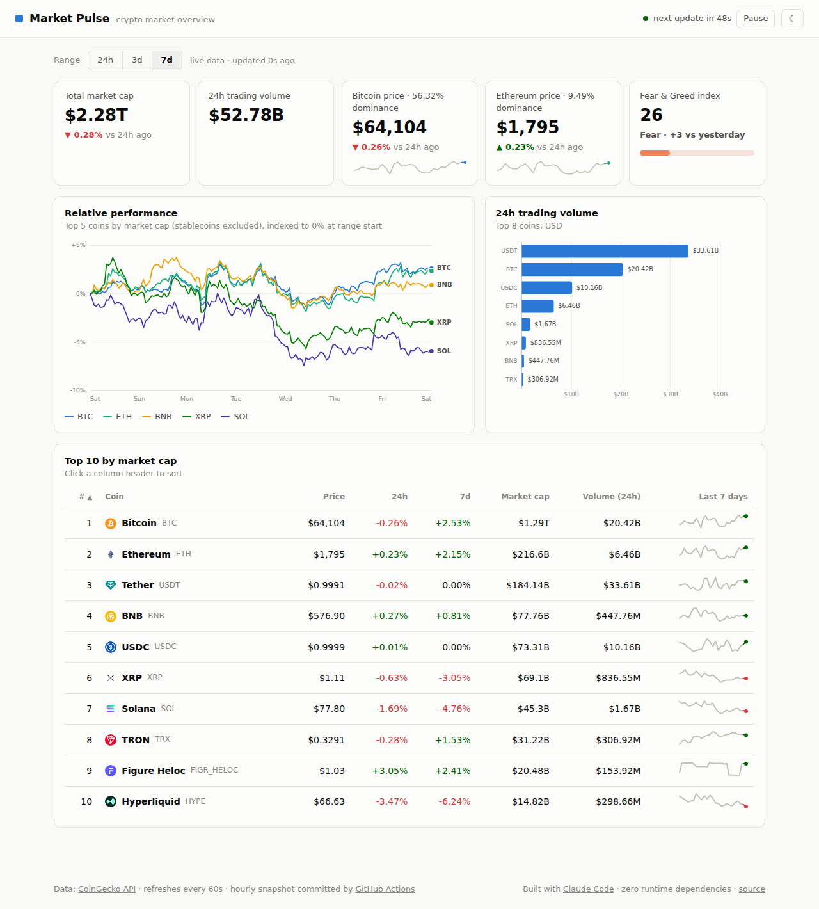
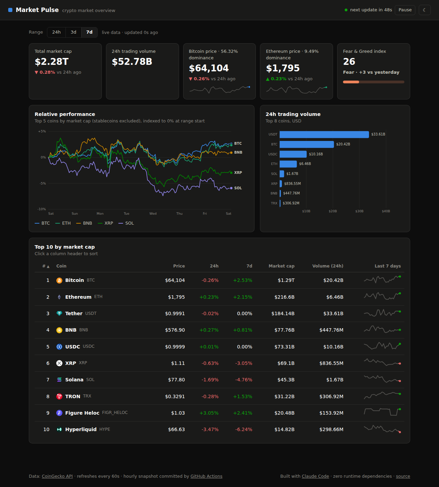

# Market Pulse 📈

**Live crypto market dashboard — zero dependencies, self-updating, built end-to-end with [Claude Code](https://claude.com/claude-code).**

[](https://github.com/mooceanstudio/claude-market-pulse/actions/workflows/update-data.yml)
[](https://github.com/mooceanstudio/claude-market-pulse/actions/workflows/deploy-pages.yml)
[](LICENSE)

**Live demo → https://mooceanstudio.github.io/claude-market-pulse/**



## What it does

- **Pulls data from two APIs** — [CoinGecko](https://www.coingecko.com/en/api) (top-10 market data, 7-day hourly price history, global stats) and [alternative.me](https://alternative.me/crypto/fear-and-greed-index/) (Fear & Greed index) — and **auto-refreshes every 60 seconds** with a visible countdown and pause control.
- **Visualizes it** with hand-rolled SVG (no chart library, no framework, no build step):
  - stat tiles with 24h deltas and sparklines, plus a status-colored Fear & Greed meter
  - a multi-series indexed performance chart with crosshair + all-series tooltip
  - a 24h volume bar chart with per-bar tooltips
  - a sortable top-10 market table with 7-day trend sparklines
  - a time-range filter (24h / 3d / 7d) that re-scopes the charts
  - full light/dark theming (OS preference + manual toggle)
- **Automates updates** two ways:
  - a GitHub Action commits an hourly data snapshot (`data/snapshot.json`), so the dashboard degrades gracefully to cached data when the live API is rate-limited or unreachable — the UI tells you which source you're seeing
  - every push (including the bot's snapshot commits) auto-deploys to GitHub Pages

## Built with Claude Code — not just *using* Claude

This repo doubles as a demonstration of a real Claude Code project setup:

| Piece | What it shows |
|---|---|
| [`CLAUDE.md`](CLAUDE.md) | Project memory: architecture, verify steps, design-system rules and API gotchas that keep every future Claude session consistent |
| [`.claude/skills/add-widget/`](.claude/skills/add-widget/SKILL.md) | A **custom Claude Skill** that scaffolds new dashboard widgets — form choice, data wiring, mark specs, and a verification checklist — so "add a widget" is a one-prompt operation |
| The Fear & Greed tile | **The skill in action**: this widget was added *after* the initial release by following `add-widget` end-to-end — new API source wired into both the live fetch and the snapshot fallback, meter component, both-theme verification — in a single short session |
| [`.github/workflows/`](.github/workflows/) | Automation authored by Claude Code: hourly data cron + Pages deploy |
| Design system | Chart colors come from a colorblind-validated palette (CVD-checked in both themes), one-hue-per-measure, no dual axes, tooltips built with `textContent` against untrusted API strings |

## Architecture

```
Browser ──60s──▶ CoinGecko + alternative.me ──fail?──▶ data/snapshot.json (fallback)
                                              ▲
GitHub Actions (hourly cron) ── fetch-snapshot.mjs ── commit ──▶ Pages deploy
```

```
index.html                 static shell — one card per widget
css/style.css              all design tokens, light + dark
js/
  config.js                endpoints, cadence, palette slots
  api.js                   live fetch → snapshot fallback
  charts.js                SVG line/bar/sparkline renderers + tooltip layer
  table.js                 sortable market table
  app.js                   state, refresh loop, theme, renderAll()
scripts/fetch-snapshot.mjs snapshot fetcher (run by the hourly Action)
```

## Run locally

No install, no build:

```bash
git clone https://github.com/mooceanstudio/claude-market-pulse.git
cd claude-market-pulse
python3 -m http.server 8080   # any static server works
# open http://localhost:8080
```

Refresh the fallback snapshot: `node scripts/fetch-snapshot.mjs`

## Design notes

- **Indexed, not dual-axis.** Comparing BTC ($64k) with XRP ($1) on one chart is done by indexing every series to 0% at range start — never with a second y-axis.
- **Stablecoins are excluded from the performance chart** (they're flat by definition) but kept in the volume chart and table, where they matter.
- **Accessible by construction.** The categorical palette is validated for color-vision deficiency in both themes; every chart value is also reachable without hover (direct labels, axis ticks, or the table).
- **Refetch keeps the frame.** While new data loads, the previous render dims instead of flashing a skeleton.

<details>
<summary>Dark mode screenshot</summary>



</details>

## License

[MIT](LICENSE)
